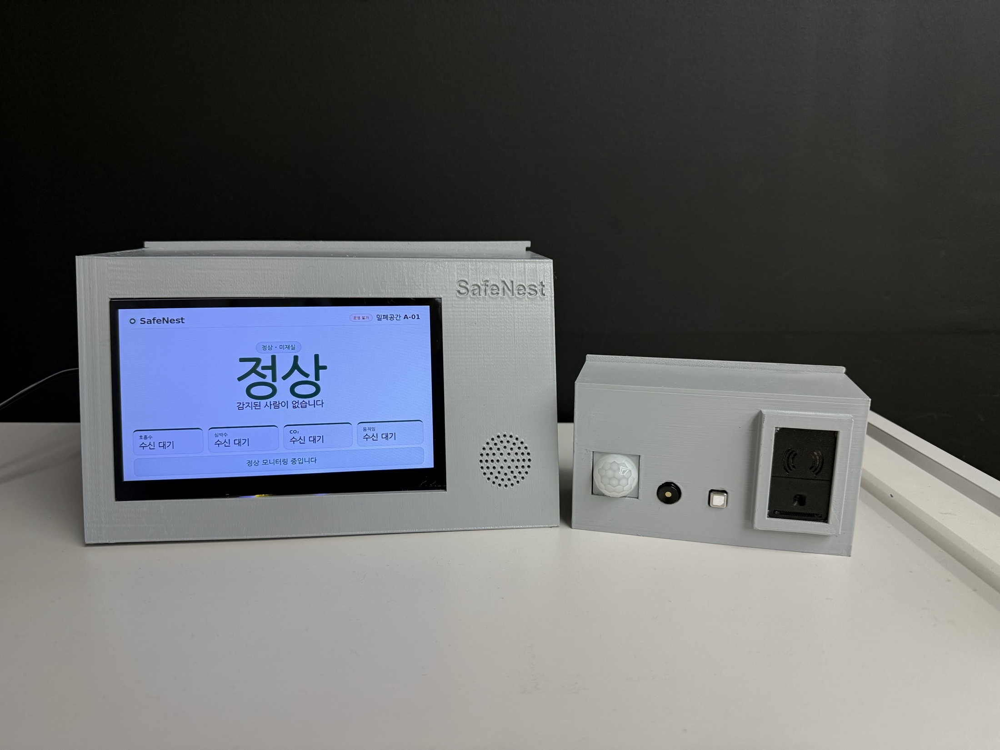
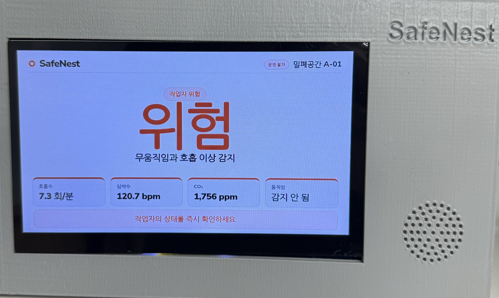
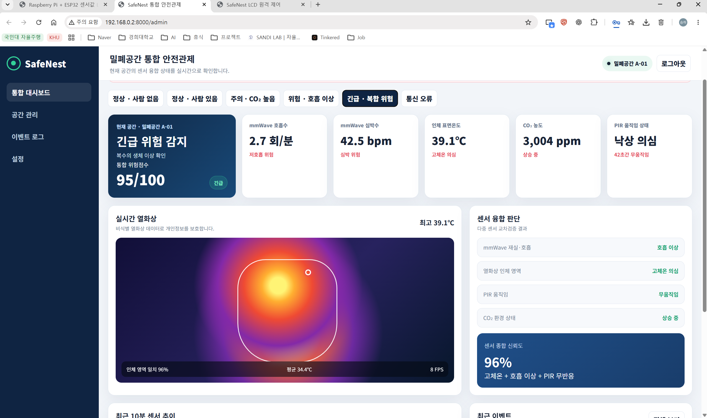

# SafeNest

밀폐공간 작업자의 **호흡·움직임·자세**와 **공기질**을 동시에 감시해, 위험을 스스로 알릴 수 없는 상태가 되기 전에 경보하는 임베디드 안전 모니터링 시스템.



| 현장 LCD 패널 | 관제 웹 대시보드 |
|---|---|
|  |  |

---

## 프로젝트 개요

**문제.** 맨홀·정화조·탱크 같은 밀폐공간 질식 재해는 쓰러진 뒤에는 본인이 도움을 요청할 수 없다. 사고의 대부분은 "감지가 늦어서"가 아니라 "아무도 보고 있지 않아서" 커진다. 반대로 CO₂ 센서만 두면 사람이 이미 무호흡 상태여도 공기질이 기준 이하면 정상으로 표시된다.

**접근.** SafeNest는 한 가지 신호에 의존하지 않는다. mmWave 레이더로 **호흡**을, 열화상으로 **자세**를, PIR로 **움직임**을, NDIR 센서로 **CO₂**를 각각 독립적으로 관측하고, 네 결과를 하나의 위험도로 융합한다.

추론은 전부 Raspberry Pi 위에서 수행된다. **센서 데이터 처리, AI 추론, 위험도 판단, 현장 경보(부저·TTS), 화면 표시는 클라우드 서버 없이 Pi 안에서 완결된다.** ESP32 센서 노드와 Raspberry Pi 사이는 현장 Wi-Fi 의 TCP/UDP 로 연결되므로 이 구간이 끊기면 해당 센서는 데이터 없음(`INDETERMINATE`) 으로 처리된다.

**적용 환경.** 밀폐공간 단독·소수 작업, 상시 관제 인력이 없는 현장.

---

## 핵심 기능

- **4채널 센서 수집** — mmWave 호흡/심박, MH-Z19B CO₂, PIR 움직임, 80×62 열화상 프레임
- **이중 전송 경로** — 저속 스칼라는 TCP(`SNST` v1), 열화상 프레임은 청크 UDP(`SNTU` v1). 프레임 CRC32·형상·길이를 모두 검증하고 순서 무관 재조립
- **센서 상태 관리** — 센서별 freshness/유효성을 값과 분리해 추적. 오래된 값을 최신값처럼 표시하지 않음
- **온디바이스 AI 3종** — Thermal 자세 proxy(TFLite), CO₂ 재실 판정(TFLite INT8), mmWave 호흡 파형(PyTorch). 각 모델은 서로 격리되어 하나가 실패해도 나머지 판단이 유지됨
- **증거 충분성 기반 위험도 융합** — 가중합에 더해 ① 심각 신호가 평온한 신호에 희석되지 않는 escalation floor, ② 근거가 부족하면 NORMAL 대신 `INDETERMINATE` 를 게시하는 evidence gate, ③ 상위 두 확률 차가 작으면 "판단 없음"으로 처리하는 decisiveness gate
- **비상 대응 HMI** — 위험 확정 시 부저, 로컬 한국어 TTS 음성 안내, 담당자 SMS, 경보 확인/해제 절차
- **관제 화면 3종** — 관리자 포털, 관제 대시보드, QR 게스트 화면
- **현장 LCD 패널** — Raspberry Pi 로컬 LCD 상태 화면
- **SQLite 영속화** — 상태 스냅샷과 전이 이벤트 기록, 디스크 쿼터를 지키는 원시 센서 로깅

---

## System Architecture

```
MR60BHA2 (호흡·심박) ┐
MH-Z19B   (CO₂)      ├─→ ESP32 ─┬─ TCP  :9000  SafeNest v1 스칼라 telemetry
PIR       (움직임)   │          └─ UDP  :5005  Thermal 청크 프레임
MI48xx    (열화상)   ┘                 │
                                       ▼
                        Raspberry Pi ── Gateway (프로토콜 검증 / UDP 재조립)
                                       │
                                       ▼
                              Sensor State Manager  (freshness · 유효성 · revision)
                                       │
                                       ▼
                              On-device AI Pipeline
                                 ├ Thermal  TFLite fp32
                                 ├ CO₂      TFLite int8
                                 └ mmWave   PyTorch fp32
                                       │
                                       ▼
                              Risk Formula V1  (가중합 + escalation floor + evidence gate)
                                       │
                     ┌─────────────────┼─────────────────┐
                     ▼                 ▼                 ▼
                  SQLite         FastAPI :8000       Emergency
              (이벤트/이력)      REST + WebSocket   부저 · TTS · SMS
                                       │
                     ┌─────────────────┼─────────────────┐
                     ▼                 ▼                 ▼
                  /admin           /dashboard      /display (LCD)
                                   /guest/...
```

위험 등급: `NORMAL` · `WARNING` · `DANGER` · `INDETERMINATE`(근거 부족)

---

## Hardware

| 장치 | 부품 | 연결 |
|---|---|---|
| 센서 노드 MCU | ESP-WROOM-32 (ESP32 Dev Module) | — |
| 호흡 · 심박 · 재실 | Seeed MR60BHA2 60 GHz mmWave | UART2 GPIO 16/17 |
| CO₂ | Winsen MH-Z19B NDIR | UART1 GPIO 32/33 (별도 4.5–5.5 V 전원) |
| 움직임 | PIR 모션 센서 | GPIO 13 |
| 열화상 80×62 | MI48xx 기반 Thermal Camera HAT | I²C 21/22 제어 + SPI 18/19/23/27, READY 26, RESET 25 |
| 게이트웨이 · AI · 백엔드 | Raspberry Pi 5 | 2.4 GHz Wi-Fi |
| 표시 | Raspberry Pi 연결 LCD (Chromium 키오스크) | — |
| 경보 | 부저(GPIO), 스피커 | — |

외함 STL 과 설계 사양은 [`hardware/3d_models/`](hardware/3d_models/) 에 있다.

---

## Repository Structure

```
.
├── run_safenest.sh                  ★ 공식 실행 진입점 (유일)
├── README.md · THIRD_PARTY_NOTICES.md · COMPONENT_SOURCES.json
│
├── ESP32/
│   ├── Arduino/esp32_sensor_node_mhz19b_20260901-2130-junwoo/
│   │   ├── esp32_sensor_node_mhz19b_20260901-2130-junwoo.ino   ★ 정본 펌웨어
│   │   ├── secrets.example.h
│   │   └── ESP32_UPDATE_CHANGELOG_KO_20260901-2130-junwoo.md
│   └── docs/            빌드 환경 가이드 · 통신 프로토콜 명세
│
├── RaspberryPi/
│   ├── Runtime/         ★ 게이트웨이 · 상태 · AI · 위험도 · 백엔드 · DB
│   │   ├── deployment/  run_pi.sh · verify_bundle.py
│   │   ├── gateway/     protocol.py · receiver.py · thermal_udp.py
│   │   ├── state/       manager.py
│   │   ├── ai/          pipeline.py · runtime.py · mmwave_b23_* · co2_canonical_runtime.py
│   │   ├── risk/        formula_v1.py · risk_formula_v1.json · engine.py
│   │   ├── backend/     app.py · run_backend.py · runtime.py · views.py · portal.py
│   │   ├── database/    schema.sql · repository.py · store.py
│   │   ├── services/    tts.py · buzzer.py · sms_service.py · emergency.py
│   │   ├── storage/     sensor_logger.py
│   │   ├── hil/         preflight.py(기동 필수) · 현장 수집/판정 도구
│   │   ├── tests/       소프트웨어 테스트
│   │   └── docs/        런타임 기술 문서
│   ├── Ondevice_AI/
│   │   ├── inference/   ★ Thermal·CO₂ 활성 어댑터 (+ 비활성 M-N9)
│   │   ├── models/      ★ model_manifest.json + 모델 아티팩트
│   │   ├── risk/        risk_config.json (구형 V4, 활성 엔진 미사용)
│   │   └── tests/       활성 Thermal 모델 계약 테스트
│   ├── Web/             ★ 관리자 포털 · 대시보드 · 게스트 화면
│   │   └── vendor/      외부 라이브러리 로컬 포함 (Chart.js)
│   └── LCD/static/      ★ display.html · common.css
│
├── scripts/validation/  검증용 실행 도구 (production 진입점 아님)
├── docs/
│   ├── operations/      Raspberry Pi 현장 운영 절차
│   ├── validation/      Thermal 모델 A/B 비교 절차
│   ├── reports/         Thermal 실측 기록
│   └── thermal/         모델 비교 문서
├── hardware/            3D 하우징 STL 및 설계 사양
└── final-report/        대회 개발완료보고서 PDF/PPTX 및 이미지 자산
```

---

## 실행되는 코드

런타임이 실제로 로드하는 진입점과 자산은 다음이다. 저장소에는 이 밖에 비활성 모델 아티팩트와 데모 모드 전용 대시보드 자산이 함께 보관되어 있으며, 어느 것도 기본 실행 경로에 로드되지 않는다.

| 구성 | 경로 |
|---|---|
| **ESP32 펌웨어** | [`ESP32/Arduino/esp32_sensor_node_mhz19b_20260901-2130-junwoo/esp32_sensor_node_mhz19b_20260901-2130-junwoo.ino`](ESP32/Arduino/esp32_sensor_node_mhz19b_20260901-2130-junwoo/esp32_sensor_node_mhz19b_20260901-2130-junwoo.ino) |
| **Runtime 진입점** | [`run_safenest.sh`](run_safenest.sh) → [`RaspberryPi/Runtime/deployment/run_pi.sh`](RaspberryPi/Runtime/deployment/run_pi.sh) → [`RaspberryPi/Runtime/backend/run_backend.py`](RaspberryPi/Runtime/backend/run_backend.py) |
| **Web 관리자** | [`RaspberryPi/Web/portal/preview.html`](RaspberryPi/Web/portal/preview.html) + `portal/admin-api.js` + `portal/thermal-client.js` |
| **Web 대시보드** | [`RaspberryPi/Web/index_final.html`](RaspberryPi/Web/index_final.html) + `app_final.js` + `styles_final.css` |
| **Web 게스트** | [`RaspberryPi/Web/guest/index.html`](RaspberryPi/Web/guest/index.html) |
| **LCD** | [`RaspberryPi/LCD/static/display.html`](RaspberryPi/LCD/static/display.html) + [`RaspberryPi/LCD/static/common.css`](RaspberryPi/LCD/static/common.css) |

경로 상수는 [`RaspberryPi/Runtime/paths.py`](RaspberryPi/Runtime/paths.py) 한 곳에 모여 있다.

---

## 핵심 코드

| # | 파일 | 역할 |
|---|---|---|
| 1 | [ESP32 정본 펌웨어](ESP32/Arduino/esp32_sensor_node_mhz19b_20260901-2130-junwoo/esp32_sensor_node_mhz19b_20260901-2130-junwoo.ino) | 4센서 수집, `delay()` 없는 millis 스케줄링, TCP/UDP 를 각각 FreeRTOS 태스크로 분리, 1-슬롯 열화상 큐로 최신 프레임 우선 |
| 2 | [`gateway/protocol.py`](RaspberryPi/Runtime/gateway/protocol.py) | `SNST` v1 16바이트 헤더 파싱과 페이로드 검증, 9,936바이트 열화상 계약 |
| 3 | [`gateway/thermal_udp.py`](RaspberryPi/Runtime/gateway/thermal_udp.py) | 청크 UDP 순서 무관 재조립, CRC32·형상·범위 검증, 프레임 타임아웃 |
| 4 | [`state/manager.py`](RaspberryPi/Runtime/state/manager.py) | 센서별 freshness/유효성/기기 건강을 값과 분리해 관리, publication revision 발행 |
| 5 | [`ai/pipeline.py`](RaspberryPi/Runtime/ai/pipeline.py) | 모델별 격리 평가. mmWave 는 wire rate 로 누적, CO₂ 는 measurement-event 기준으로 누적 |
| 6 | [`ai/runtime.py`](RaspberryPi/Runtime/ai/runtime.py) | 지연 로딩 + 실패 격리 어댑터. manifest selector 와 런타임이 어긋나면 `MODEL_SELECTOR_DRIFT` 로 차단 |
| 7 | [`ai/mmwave_b23_runtime.py`](RaspberryPi/Runtime/ai/mmwave_b23_runtime.py) | 활성 mmWave 경로. 30초 호흡 파형을 10 Hz 300표본으로 정규화 후 621차원 입력 생성 |
| 8 | [`risk/formula_v1.py`](RaspberryPi/Runtime/risk/formula_v1.py) | **활성 위험도 엔진.** 가중합 + escalation floor + evidence sufficiency + decisiveness gating |
| 9 | [`backend/app.py`](RaspberryPi/Runtime/backend/app.py) | FastAPI 라우트, WebSocket 게시, Web/LCD 서빙, 공간 포털, 비상 액션 API |
| 10 | [`hil/preflight.py`](RaspberryPi/Runtime/hil/preflight.py) | 기동 전 필수 검사. 모든 모델 SHA256 을 manifest 와 대조해 불일치 시 기동 차단 |

---

## Installation

Raspberry Pi 5 / 64-bit OS / **Python 3.10 이상** 기준.

```bash
git clone https://github.com/jinsu1011/safenest-embedded-competition-bridege.git safenest
cd safenest
./run_safenest.sh --install
```

`--install` 이 수행하는 것:

1. 저장소 루트에 `.venv` 생성
2. `RaspberryPi/Runtime/requirements-backend.txt` 설치 — FastAPI, uvicorn, qrcode, piper-tts
3. `RaspberryPi/Ondevice_AI/requirements-pi.txt` 설치 — LiteRT, numpy/scipy, spidev/smbus2, **torch(CPU wheel index 사용)**
4. `import fastapi, piper, qrcode, torch, uvicorn` 로 설치 검증
5. Piper 한국어 음성 `ko_KR-kss-medium` 다운로드 (`RaspberryPi/Runtime/data/tts/`, Git 미추적)

> **torch 가 필수인 이유** — 활성 mmWave 경로 B23 은 PyTorch float32 모델이고, 해당 모듈이 `backend/app.py → backend/runtime.py → ai/pipeline.py` import 체인에 포함된다. torch 가 없으면 백엔드가 기동되지 않는다.
> 일반 PyPI 의 ARM64 torch 는 Pi 에 없는 CUDA/NVIDIA 의존성을 끌어오므로, `requirements-pi.txt` 는 공식 CPU wheel index(`https://download.pytorch.org/whl/cpu`)를 함께 지정한다.

민감 설정은 저장소 루트 `.env` 로 주입한다. 키 목록은 [`RaspberryPi/Runtime/.env.example`](RaspberryPi/Runtime/.env.example) 참고 (SMS 자격증명, 담당자 연락처, 부저 GPIO, 센서 데이터 쿼터 등). `.env` 는 Git 에 올리지 않는다.

---

## Execution

**공식 실행 방법은 하나다.**

```bash
./run_safenest.sh
```

이 한 줄이 하나의 프로세스 트리에서 다음을 모두 띄운다.

| 구성 | 포트 |
|---|---|
| SafeNest TCP v1 게이트웨이 (mmWave/CO₂/PIR) | `9000/tcp` |
| SafeNest Thermal UDP v1 수신기 | `5005/udp` |
| FastAPI + WebSocket (Web · LCD · API) | `8000/tcp` |

기동 직전 `hil.preflight` 가 Python 버전, 필수 모듈, 포트 가용성, **모델 SHA256 계약**을 검사하고 실패 시 기동을 중단한다.

주요 옵션은 그대로 전달된다. 예: `./run_safenest.sh --api-port 8080 --room "밀폐공간 B-02"`

<details>
<summary>선택: Thermal 모델 A/B 비교 실행</summary>

```bash
scripts/validation/run_safenest_thermal_test.sh baseline   # 현재 활성 모델
scripts/validation/run_safenest_thermal_test.sh a          # TV2 Candidate A
scripts/validation/run_safenest_thermal_test.sh b          # TV2 Candidate B
```

manifest 에서 `controlled_test_allowed: true` 인 모델만 선택되며, 평시 운영 경로(`./run_safenest.sh`)는 영향을 받지 않는다. Candidate A/B 는 비교 대상이지 배포 모델이 아니다. 절차는 [`docs/validation/PI_RUNBOOK_THERMAL.md`](docs/validation/PI_RUNBOOK_THERMAL.md).
</details>

---

## ESP32 Build & Flash

1. Arduino IDE 에 ESP32 보드 패키지 설치 후 **ESP32 Dev Module** 선택
2. Library Manager 에서 **Seeed Arduino mmWave** 설치 (하위 의존성 `Install all`)
3. 자격증명 파일 생성 — 실제 값은 커밋되지 않는다

   ```bash
   cd ESP32/Arduino/esp32_sensor_node_mhz19b_20260901-2130-junwoo
   cp secrets.example.h secrets.h
   ```

   `secrets.h` 에 2.4 GHz Wi-Fi SSID/비밀번호, Raspberry Pi 의 WLAN IPv4(`RPI_HOST`), TCP 포트(`RPI_PORT`, 기본 9000)를 입력한다. 열화상 UDP 도 같은 호스트의 5005 로 전송된다.
4. `esp32_sensor_node_mhz19b_20260901-2130-junwoo.ino` 를 열어 컴파일 후 업로드
5. Serial Monitor `115200 baud` 에서 `[health]` 로그의 `wifi=up`, `rpi=<Pi IP>`, `udp_sent` 증가 확인

상세 절차·배선표·오류 대응은 [`ESP32/docs/ARDUINO_ENVIRONMENT_SETUP_KO.md`](ESP32/docs/ARDUINO_ENVIRONMENT_SETUP_KO.md), 와이어 포맷은 [`ESP32/docs/COMMUNICATION_PROTOCOL.md`](ESP32/docs/COMMUNICATION_PROTOCOL.md).

---

## Web Dashboard

`./run_safenest.sh` 실행 후 같은 네트워크에서 접속한다. 별도 웹 서버는 없다.

| 화면 | URL | 서빙 파일 |
|---|---|---|
| 관리자 포털 (기본 진입) | `http://<pi>:8000/admin` | `Web/portal/preview.html` |
| 관제 대시보드 | `http://<pi>:8000/dashboard` | `Web/index_final.html` |
| 게스트 QR 화면 | `http://<pi>:8000/guest/dashboard/<space_id>` | `Web/guest/index.html` |
| LCD 패널 | `http://<pi>:8000/display` | `LCD/static/display.html` |
| 헬스체크 | `http://<pi>:8000/health` | — |

`http://<pi>:8000/` 은 `/admin` 으로 리다이렉트된다.

**모든 화면은 외부 네트워크 자산을 참조하지 않는다.** 그래프 라이브러리(Chart.js 4.5.1)까지 저장소에 포함해 `/vendor/chart.js/chart.umd.min.js` 로 같은 서버가 서빙하므로, 인터넷이 없는 현장에서도 관리자·대시보드·게스트·LCD 화면이 모두 완전하게 동작한다. 출처와 라이선스는 [`THIRD_PARTY_NOTICES.md`](THIRD_PARTY_NOTICES.md) 6장 참고.

**API / WebSocket** — 전체 계약은 [`backend/views.py`](RaspberryPi/Runtime/backend/views.py) 의 `ROUTE_CONTRACTS` 에 정의되어 있다.

| 종류 | 경로 |
|---|---|
| 상태 | `GET /api/status` · `GET /api/sensors` · `GET /api/state` |
| 이력 | `GET /api/events` · `GET /api/history` |
| 공간 관리 | `GET/POST /api/spaces` · `GET/PATCH/DELETE /api/spaces/{id}` · `GET /api/qr/{id}.png` |
| 열화상 | `GET /api/thermal/{space_id}` (ETag 기반 바이너리 프레임) |
| 비상 대응 | `POST /api/emergency/contact` · `/acknowledge` · `/recovery/acknowledge` · `/voice` |
| 실시간 | `WS /ws` — publication revision 이 바뀔 때만 상태 문서 전송 |

**관리자 계정은 저장소에 없다.** `/admin` 로그인은 환경변수로만 설정한다.

```bash
export SAFENEST_ADMIN_ID=...
export SAFENEST_ADMIN_PASSWORD=...
export SAFENEST_AUTH_SECRET=...        # 선택. 없으면 프로세스마다 무작위 서명 키
```

두 값을 모두 설정하기 전까지 로그인은 **항상 거부**된다(fail-closed). 빈 값끼리 일치해 통과하는 경로도 없다. 나머지 런타임·API·LCD·게스트 화면은 계정 설정과 무관하게 정상 동작하며, 현재 설정 여부는 `GET /health` 의 `admin_auth_configured` 로 확인한다.

`SAFENEST_DEMO_MODE=1` 로 실행하면 데모 전용 화면(`/control`, `/dashboard` 의 데모판)과 119 신고 시뮬레이션 API 가 추가로 열린다. 평시 운영에서는 사용하지 않는다.

---

## LCD

Raspberry Pi 에 연결된 LCD 는 **통합 백엔드가 직접 서빙**한다. 별도 LCD 서버 프로세스는 없다.

| 경로 | 파일 |
|---|---|
| `/display` | `RaspberryPi/LCD/static/display.html` |
| `/common.css` | `RaspberryPi/LCD/static/common.css` |

`display.html` 은 `GET /api/state` 를 폴링해 갱신하며, 외부 자산을 참조하지 않는다. Chromium 키오스크 실행·종료 절차는 [`RaspberryPi/LCD/LCD_KIOSK_KO.md`](RaspberryPi/LCD/LCD_KIOSK_KO.md).

---

## On-device AI

추론은 모두 Raspberry Pi 에서 수행된다. 활성 모델은 [`models/model_manifest.json`](RaspberryPi/Ondevice_AI/models/model_manifest.json) 이 selector 와 SHA256 으로 고정하며, 기동 시 preflight 가 전 항목을 대조한다.

| 센서 | selector | 아티팩트 | 형식 | 출력 |
|---|---|---|---|---|
| Thermal | `thermal_public_sdt_fp32_active` | `models/thermal/public_sdt/public_sdt_pooled_mlp_fp32_tflite_v1.tflite` | TFLite fp32 | `NOT_HUMAN` / `HUMAN_NORMAL` / `HUMAN_FALL_PROXY` |
| CO₂ | `co2_occupancy_c_b6` | `models/rp_x0_b_complete/co2/C_B6_REDUCED_CO2_SLOPE_CANDIDATE_001_full_integer_int8.tflite` | TFLite full-int8 | 실내 재실 여부 |
| mmWave | `mmwave` (M-PROT-B23) | `models/mmwave/m_prot_b23/candidate_seed_23.pt` | PyTorch fp32 | 호흡 파형 판정 + 품질 |

**실행 경로.** [`ai/pipeline.py`](RaspberryPi/Runtime/ai/pipeline.py) 가 세 모델을 서로 격리해 평가한다.

| 센서 | 호출되는 코드 |
|---|---|
| Thermal | `ai/runtime.py` 의 `LazyModel` → `Ondevice_AI/inference/thermal_interpreter.py` |
| CO₂ | `ai/runtime.py` 의 `LazyModel` → `Ondevice_AI/inference/co2_c_b6_interpreter.py` |
| mmWave | [`ai/mmwave_b23_runtime.py`](RaspberryPi/Runtime/ai/mmwave_b23_runtime.py) 의 `B23TeamRuntime` (PyTorch 직접 실행) |

> **M-N9 은 활성 경로가 아니다.** `Ondevice_AI/inference/mmwave_m_n9_interpreter.py` 와
> `models/mmwave/m_n9/MMWAVE_M_N9_FULL_INT8_V1.tflite` 가 저장소에 남아 있지만,
> `ai/pipeline.py` 의 mmWave 경로는 항상 `B23TeamRuntime` 을 호출하므로 이 어댑터는
> 실행되지 않는다. manifest 에서도 `deployment_allowed: false`,
> `runtime_role: LEGACY_M_N9_NONACTIVE` 이며 강제 로드 시 `MODEL_RELEASE_BLOCKED` 로
> 차단된다. 파일이 남아 있는 이유는 기동 preflight 가 manifest 에 등재된 모든
> 아티팩트의 SHA256 을 검증하기 때문이다.

**주장 범위를 명시한다.**

- Thermal 모델은 공개 데이터(SDT)로 학습했고 **위험도에서는 사람 유무만** 판정한다. 실제 낙상 이벤트를 검증하지 않았다. 위험도에 들어가는 자세(서기·앉기 vs 눕기)는 모델 softmax 가 아니라 bbox 종횡비 오버레이가 정하며, `HUMAN_FALL_PROXY` 는 제한된 가중치(0.4)의 자세 proxy 로서 단독으로 비상을 선언하지 못한다.
- CO₂ 모델의 의미는 **실내 재실 판정**이며 질식·유해가스 ground truth 가 아니다. 안전 판정은 모델이 아니라 규칙이 담당한다. 빈방에서는 위험·긴급을 선언하지 않는다. 주의(`WARNING`)는 로컬라이징 기준값 대비 상대 상승(+500 ppm 진입 / +350 ppm 해제)과 CO₂ 기울기(50 ppm/min)로만 발생하고, 남아 있는 절대 ppm 트립은 비상 오버라이드 5,000 ppm 하나뿐이다.
- mmWave B23 은 prototype integration freeze 단계로, 위험도 기여가 유보(`risk_contribution_deferred`)되어 있다.

학습 데이터 출처와 이용 조건은 [`THIRD_PARTY_NOTICES.md`](THIRD_PARTY_NOTICES.md) 5장 참고. 원본 데이터셋은 저장소에 포함하지 않는다.

---

## Risk Engine

활성 엔진은 [`RaspberryPi/Runtime/risk/formula_v1.py`](RaspberryPi/Runtime/risk/formula_v1.py) (`SAFENEST_RISK_V1` v1.3.3), 설정은 [`risk/risk_formula_v1.json`](RaspberryPi/Runtime/risk/risk_formula_v1.json).

| 항목 | 값 |
|---|---|
| 가중치 | CO₂ 0.30 · Thermal 0.30 · mmWave 0.25 · PIR 0.15 |
| 종합 위험도 임계값 | `DANGER` ≥ 65 (종합 산식은 `WARNING` 을 게시하지 않는다) |
| 재실 게이트 | `DANGER`/`EMERGENCY` 는 `presence_detected == true` 일 때만 발생. 비재실이면 종합 위험도는 `NORMAL` |
| 주의 산식 | `SAFENEST_CAUTION_CO2_V1` — CO₂ 단독. 기준값 대비 +500 ppm 진입 · +350 ppm 해제 · 기울기 50 ppm/min |
| 비상 절대 트립 | CO₂ 5,000 ppm (유일한 절대 ppm 트립). 재실이면 즉시 긴급, 비재실이면 `WARNING` 으로 강등 |
| Thermal 자세 | 모델은 사람 유무만 판정. 서기/앉기 vs 눕기는 bbox 종횡비 오버레이 (`HUMAN_NORMAL` 0.0 / `HUMAN_FALL_PROXY` 0.4). 오버레이 실패 시 `PRESENCE_ONLY` + `HUMAN_NORMAL` |
| 증거 게이트 | 사용 가능한 구성요소의 가중치 합이 0.5 미만이면 `INDETERMINATE` |

단순 가중합이 갖지 못한 다섯 가지 성질을 갖는다.

1. **Escalation floor** — 심각한 신호 하나가 평온한 신호 셋에 희석되어 NORMAL 로 떨어지지 않는다.
2. **Evidence sufficiency** — 근거가 부족하면 NORMAL 을 게시하지 않고 `INDETERMINATE` 를 게시한다. "센서가 죽어서 조용한 것"과 "실제로 안전한 것"을 구분한다.
3. **Decisiveness gating** — 상위 두 확률의 차가 기준 미만인 분류 결과는 점수화하지 않고 "판단 없음"으로 처리한다.
4. **Caution 분리** — `WARNING` 은 가중합 점수 구간이 아니라 CO₂ 전용 주의 산식이 만든다. mmWave·PIR·Thermal 은 점수와 `DANGER`/`EMERGENCY` 에는 기여하지만 주의를 올리지 못한다. 밀폐 공간이 상시 1,500 ppm 근처에 머물러 종일 `WARNING` 을 만들던 절대 임계값(1,500 ppm)과 `danger_ppm` 2,500 ppm 은 제거했다.
5. **재실 게이팅** — 빈방에서는 위험·긴급을 만들지 않는다. `DANGER`/`EMERGENCY` 는 `presence_detected == true` 를 요구하고, 사람이 없는 공간의 5,000 ppm 은 `WARNING` 으로만 게시한다. 사람이 확인된 공간의 5,000 ppm 은 즉시 긴급이다. 자세 판정도 같은 원칙을 따른다 — 모델은 사람 유무만 결정하고, 위험도에 들어가는 서기/앉기 vs 눕기는 bbox 오버레이가 정한다. 모델의 눕기 softmax 는 위험도 입력이 아니며, 오버레이가 실패하면 `PRESENCE_ONLY` + `HUMAN_NORMAL` 로 떨어진다.

규칙 임계값(호흡 정상범위 10–24 rpm, 무호흡 지속 판정, PIR 무움직임 유예 30초 · 위험 180초, CO₂ 상대 +500/−350 ppm 및 절대 비상 5,000 ppm)은 활성 엔진이 읽는 [`RaspberryPi/Runtime/risk/risk_formula_v1.json`](RaspberryPi/Runtime/risk/risk_formula_v1.json) 한 곳에 있다.

---

## Validation

**검증 환경:** Raspberry Pi 5 (aarch64) / Debian 13 / Python 3.13.5 / 런타임 venv (fastapi 0.141.1, uvicorn, numpy 1.26.4, scipy, ai-edge-litert, torch 2.13.0+cpu, qrcode). 아래 소프트웨어 검증은 실제 배포 대상 Raspberry Pi 에서 실행했다. ESP32 빌드 환경은 사용하지 않았고, 센서 실측 결과는 별도 evidence 문서를 따른다.

| 항목 | 결과 | 비고 |
|---|---|---|
| Python 구문 검사 (전체 추적 `.py`) | **PASS** | 오류 0 |
| Shell 구문 검사 (`bash -n`) | **PASS** | `run_safenest.sh`, `run_pi.sh`, 검증 런처 |
| Runtime 테스트 (`RaspberryPi/Runtime/tests`) | **417 passed · 21 failed · 1 skipped** | Risk 1.3.3 / 재실 게이팅 / CO₂ 주의 산식 / TTS 우선순위 테스트 포함. 실패 21건은 아래 Known Limitations 참조 |
| On-device AI 테스트 (`RaspberryPi/Ondevice_AI/tests`) | **25 passed · 2 skipped** | 활성 Thermal 모델 SHA/selector 계약 + bbox 종횡비 자세 오버레이 |
| 모델 SHA256 계약 (preflight) | **PASS** | manifest 등재 10개 아티팩트 전부 일치 |
| 제출본 무결성 (`verify_bundle.py`) | **PASS** | 필수 파일 누락 0, 금지 산출물 0 |
| Web 정적 참조 정합성 | **PASS** | `/admin` HTML → JS(58개 DOM id) → API/WS 전 경로 연결 확인 |
| HTTP smoke (19개 route + `WS /ws`) | **PASS** | 실제 앱 부팅 후 응답 확인 |
| 외부 네트워크 자산 참조 | **0건** | 웹·LCD 전체에 외부 CDN/호스트 참조 없음 |
| Chart.js 오프라인 동작 | **PASS** | 브라우저에서 `window.Chart` 4.5.1 로드·차트 인스턴스 생성 확인, 배포본 SHA-256 일치 |
| 관리자 인증 fail-closed | **PASS** | 미설정 시 로그인 거부(503)·보호 API 401, 설정 후 정상 로그인·토큰 인가 |
| LCD 자산 참조 | **PASS** | `display.html` → `common.css`, `GET /api/state` |
| 문서 링크 · 파일 참조 | **PASS** | 29개 문서 56개 상대 링크, 깨짐 0 |
| `COMPONENT_SOURCES.json` 경로 | **PASS** | 29개 구성요소 경로 전부 실재 |
| 중복 파일 검사 | **PASS** | `.gitkeep` 외 바이트 동일 중복 없음 |
| Secret 스캔 | **PASS** | 토큰·키·자격증명 값 없음. `*.example` 템플릿만 추적 |
| 추적된 DB/캐시/빌드 산출물 | **PASS** | 없음 |
| **ESP32 펌웨어 빌드** | **NOT RUN** | Arduino 빌드 환경 없음 |
| **Raspberry Pi 소프트웨어 검증** | **PASS — 실기기에서 실행** | 위 표의 테스트·preflight·부팅·HTTP/WS 검증을 배포 대상 Raspberry Pi 5 에서 직접 실행 |
| **Raspberry Pi 라이브 센서 구동** | **NOT VERIFIED** | 본 정리 작업에서 센서를 연결한 라이브 구동은 수행하지 않음 |
| **ESP32 ↔ Pi 라이브 E2E** | **NOT VERIFIED** | 실제 센서 연결 미수행 |
| **실제 낙상 이벤트 검증** | **NOT VERIFIED** | — |

> 별도 기록으로, Raspberry Pi 5 / aarch64 / torch 2.13.0+cpu 환경에서 PyTorch import, B23 모델 load, 백엔드 기동이 확인된 소유자 제공 결과가 [`RaspberryPi/Runtime/docs/mmwave/20260828_SafeNest_mmWave_B23_First_Integrated_Model_Handoff_KO_01.md`](RaspberryPi/Runtime/docs/mmwave/20260828_SafeNest_mmWave_B23_First_Integrated_Model_Handoff_KO_01.md) 15장에 있다. 이는 **pre-live 준비 상태**이며 라이브 센서 E2E 검증이 아니다.

제출본 구성 완전성은 다음으로 확인할 수 있다.

```bash
python3 RaspberryPi/Runtime/deployment/verify_bundle.py
```

---

## Known Limitations

- **웹 대시보드에 런타임 상태(O4) 표시 미구현** — 백엔드는 `runtime_status`(센서 가용성과 AI 가용성을 분리한 판정)를 `/api/status`·`/api/sensors`·`/api/state` 로 이미 게시하고 **LCD 화면은 이를 소비**한다. 반면 웹 대시보드(`Web/app.js`·`app_final.js`)는 이 필드를 읽지 않고, 요구되는 DOM 요소(`runtimeBadge`, `thermalSensor`, `thermalAiStatus`, `co2Ai`, `pirAi`)도 없다. 해당 UI 는 과거 대시보드 세대에 구현되었으나 이후 웹 화면을 새로 작성해 교체하는 과정에서 유실되었고, 백엔드·LCD·검사 계약만 남았다. `--offline-preflight` 의 관련 검사 2건과 UI 테스트 8건(대시보드 정적 검사 1건 포함)이 이 때문에 실패한다. 이 검사는 **오프라인 검사 전용**이라 Raspberry Pi 기동 경로(`pi_start_document`)에는 포함되지 않아 실행을 막지 않는다.
- **stage9 스모크 도구 테스트 실패** — 현장 수집 판정 도구(`hil/stage9_*`)의 테스트 6건이 실패 상태다. 평가 도구 자체의 문제이며 런타임 판단 경로와 무관하다.
- **LCD legacy state 매핑 테스트 실패** — `test_legacy_lcd_state_mapping` 1건이 `runtime_status` 를 기대해 실패한다. 팀 운영 저장소 동일 리비전에서도 같은 실패가 재현되는 상류 기존 이슈이며, 위 O4 미구현과 같은 원인이다.
- **preflight 모델 해시 검사 개수 불일치** — `test_hil_criteria` 가 6개를 기대하지만 manifest 에 10개 항목이 있어 실패한다. 실제 해시 검증은 10개 모두 통과한다.
- **Thermal 모델의 낙상 판정은 proxy** — 공개 데이터 기반 자세 분류이며, 실제 낙상 이벤트와 MI48xx 하드웨어 도메인에서 검증되지 않았다. 단독 비상 선언 권한이 없다.
- **mmWave B23 위험도 기여 유보** — mmWave 센서의 관찰 범위가 최대 1.5m인 점을 감안하여 prototype freeze 단계로 위험도 산출에 정식 반영되지 않는다.
- **119 신고는 시뮬레이션** — 실제 긴급 서비스와 연결되지 않으며, 데모 모드에서만 열린다.
- **관리자 계정 미설정 시 `/admin` 사용 불가** — 저장소에 기본 계정이 없으므로 `SAFENEST_ADMIN_ID` / `SAFENEST_ADMIN_PASSWORD` 를 설정해야 관리자 화면을 쓸 수 있다. 의도된 fail-closed 동작이다.
- **TTS 음성 모델 미포함** — `ko_KR-kss-medium` 은 CC BY-NC-SA 4.0 이므로 저장소에 포함하지 않고 설치 시 내려받는다.

---

## License / External Sources

프로젝트 자체 라이선스는 **아직 지정하지 않았다.**

외부 라이브러리·모델·데이터셋의 출처와 이용 조건은 [`THIRD_PARTY_NOTICES.md`](THIRD_PARTY_NOTICES.md) 에 정리했다. 특히 다음 조건은 반드시 준수한다.

- **SDT Dataset** (doi:10.5281/zenodo.4124309) — 비상업적 연구 목적 + 출처 표시
- **Piper `ko_KR-kss-medium` 음성** — CC BY-NC-SA 4.0
- **UCI Occupancy Detection Dataset** — 원 배포처 조건

저장소 구성요소별 경로·역할·분류는 [`COMPONENT_SOURCES.json`](COMPONENT_SOURCES.json) 참고.
