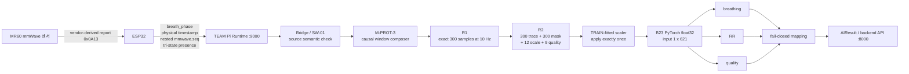
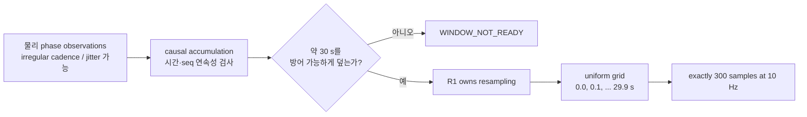
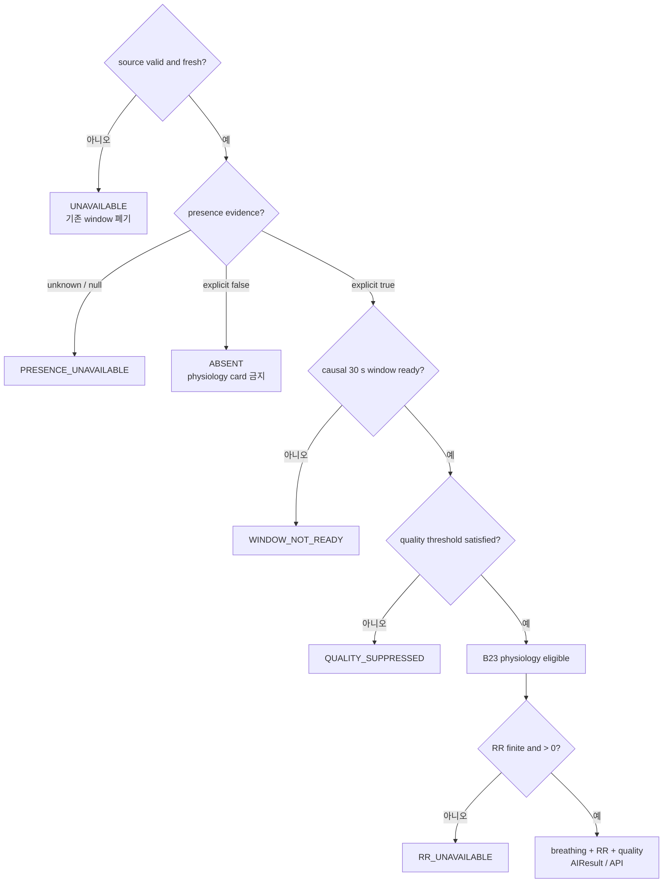

# SafeNest mmWave 1차 통합모델(B23) 개발 및 시스템 통합 기술 인수인계

> 문서 기준일: 2026-08-28
>
> 대상 저장소: `jinsu1011/safenest-embedded-competition`
>
> 기준 커밋: `1df0c178b02d700f4893728b0a9b5836941b6adc` (`main`, TEAM PR #49 병합 커밋)
>
> 적용 범위: SafeNest TEAM Raspberry Pi 런타임의 mmWave B23 1차 통합 경로
>
> 모델 지위: `PROTOTYPE_INTEGRATION_ONLY` / `NOT_FINAL_SELECTED_MODEL` / `SUBJECT_TO_REPLACEMENT`

## 1. 먼저 읽어야 할 결론

SafeNest의 현재 기본 mmWave AI 경로는 MR60이 제공하는 호흡 관련 `breath_phase` 파형을 약 30초 동안 관측하고, 물리 시간축을 R1에서 **10 Hz, 300개 표본**으로 표준화한 다음, R2에서 파형·마스크·크기/문맥·품질 정보를 합쳐 **621차원** 입력을 만든다. 이 입력에 TRAIN 데이터로 고정된 scaler를 정확히 한 번 적용하고 B23 PyTorch 모델로 다음 세 출력을 계산한다.

- 호흡 존재 가능성(`breathing`)
- 호흡수(`RR`, respiration rate)
- 입력 품질(`quality`)

B23 경로는 과거 M-N9 3분류 경로를 TEAM 런타임의 기본 mmWave AI 경로에서 대체했다. 다만 의미는 다음과 같이 제한된다.

```text
B23 = 현재 시스템 통합을 위한 1차 prototype candidate
B23 ≠ 최종 과학적 선택 모델
B23 ≠ 임상적으로 검증된 의료 모델
```

또한 30초는 모델이 계산하는 데 걸리는 시간이 아니다. **호흡의 시간적 모양을 보기 위해 모으는 관측 문맥**이다. Raspberry Pi 5에서 소요된 B23 단독 forward 시간은 사용자 제공 실측 기준 약 0.5 ms였지만, 이는 실제 센서부터 UI까지의 종단 간 지연을 뜻하지 않는다.

### 1.1 이 문서의 증거 표기

강한 표현이 저장소 증거보다 앞서가지 않도록 이 문서에서는 다음 구분을 사용한다.

| 표기 | 뜻 |
|---|---|
| `VERIFIED_FROM_REPO` | 현재 TEAM 또는 원본 개발 저장소의 코드, manifest, checksum, 테스트 결과로 재확인한 사실 |
| `OWNER_CONFIRMED / LIVE_PI_VERIFIED` | 프로젝트 소유자가 제공한 실제 Raspberry Pi 실행 기록에 근거한 사실. 현재 TEAM `main`에는 그 실행 receipt가 아직 커밋되어 있지 않음 |
| `NOT_YET_VERIFIED` | 아직 실제 ESP/MR60 연결 증거로 닫히지 않은 항목 |

현재 TEAM `main`에는 M-PROT-5C 또는 Raspberry Pi 실측 receipt가 없다. 따라서 이 문서에 실은 Pi 환경·성능 수치는 `OWNER_CONFIRMED / LIVE_PI_VERIFIED`이며 `VERIFIED_FROM_REPO`로 오표기하지 않는다. 반면 모델, scaler, 런타임 연결, 체크섬과 92개 오프라인 회귀 결과는 현재 코드에서 재확인했다.

## 2. 센서에서 API까지 한눈에 보기



중요한 경계는 다음과 같다.

- MR60 내부 vendor DSP는 센서/firmware 영역이며 B23가 수행하지 않는다.
- ESP32는 물리 관측과 provenance를 게시하며 모델 추론을 수행하지 않는다.
- R1은 시간축 표준화, R2는 표현 생성을 담당한다.
- scaler는 학습 때 정한 좌표계를 복원하며, B23는 그 좌표계의 621개 숫자를 소비한다.
- B23 출력은 곧바로 임상 상태가 아니다. presence와 quality를 포함한 fail-closed 순서를 통과해야 한다.
- B23를 위한 별도 서버는 없다. 기존 TEAM backend 및 `AIResult` 경로 안에서 동작한다.

## 3. 왜 과거 M-N9 경로를 교체했는가

과거 TEAM mmWave 기본 경로는 대략 다음 구조였다.

```text
MR60
→ M-N4 canonical window
→ 약 8 Hz / 약 240 samples
→ spectral logic
→ M-N9 INT8
→ NORMAL / RAPID_OR_ABNORMAL / APNEA-proxy
```

M-N9이 “쓸모가 없어서” 삭제된 것은 아니다. 당시의 입력 계약과 양자화 런타임, 회귀 증거를 보존하는 역사적 모델이다. 다만 다음 이유로 B23 계약과 그대로 섞을 수 없다.

- M-N9은 약 240개 표본을 사용하는 별도 표현 계약이다.
- B23은 300개 trace와 300개 mask, 21개 보조 특징을 묶은 621차원 계약이다.
- M-N9의 `APNEA-proxy`는 SafeNest가 현재 구분하는 presence·quality·breathing/RR 의미와 동일하지 않다.
- M-N9의 실제 장치 검증 범위는 제한되어 있다.
- 두 모델의 입력, 출력, safety 의미가 다르므로 한쪽을 다른 쪽의 조용한 fallback으로 쓰면 상태 의미가 훼손된다.

따라서 B23는 M-N9을 내부적으로 변형한 것이 아니라 **새로운 prototype 경로**로 통합되었다. 현재 상태는 다음과 같다.

```text
M-N9 DEFAULT ACTIVE = NO
M-N9 B23 FALLBACK = NO
CURRENT SELECTOR ROLE = ACTIVE_B23_PROTOTYPE
```

M-N9 관련 파일은 역사적 호환성, 격리 회귀 테스트와 provenance를 위해 남아 있을 수 있다. 별도 승인을 받지 않고 삭제하거나 B23 fallback으로 다시 연결하지 않는다.

## 4. MR60이 실제로 제공하는 것

### 4.1 raw RF/ADC와 `breath_phase`는 다르다

현재 SafeNest TEAM 경로가 받는 것은 raw radar RF나 ADC 샘플이 아니다. firmware가 사용하는 MR60 report `0x0A13`에서 나온 **vendor-derived phase-like breathing signal**, 즉 `breath_phase`이다.

`breath_phase`는 호흡에 따른 움직임과 관련된 위상 변화가 시간에 따라 전개되는 수치 신호다. 단일 값 하나만 보고 “호흡 중” 또는 “무호흡”이라고 해석하는 값이 아니라, 일정 시간 동안의 형태를 모델이 보도록 전달하는 파형이다.

다음 영역은 이 프로젝트가 재구성하거나 증명하지 않았다.

- MR60 칩 내부의 독점 신호 처리 단계
- raw RF/ADC부터 `0x0A13` 필드까지의 정확한 vendor DSP 알고리즘
- 해당 vendor 처리의 임상적 의미

따라서 “SafeNest가 raw radar를 직접 학습한다” 또는 “MR60 내부 DSP를 복제했다”라고 설명하면 안 된다. 현재의 정확한 표현은 **MR60이 내부 처리하여 제공한 호흡 관련 phase observation을 SafeNest가 소비한다**이다.

### 4.2 `breath_rate_raw`와의 차이

MR60/ESP telemetry에는 vendor 호흡수 scalar인 `breath_rate_raw`가 있을 수 있다. 그러나 B23의 주 입력은 `breath_phase`이고 `breath_rate_raw`는 B23의 621차원 입력에 들어가지 않는다. 이는 진단과 과거 호환용 정보다.

## 5. ESP32 → Pi producer contract

| 필드 | 물리·전송 의미 | B23 경로에서의 사용 |
|---|---|---|
| `mmwave.breath_phase` | MR60에서 파생된 물리 phase observation | 주 파형인 `Sample.phase` |
| `mmwave.ts_monotonic_ms` | 해당 phase observation의 ESP monotonic 시각 | `Sample.t = ts_monotonic_ms / 1000.0` |
| `mmwave.phase_age_ms` | telemetry를 게시할 때 observation이 얼마나 오래되었는지 | freshness 검사에만 사용; timestamp 계산에는 사용하지 않음 |
| nested `mmwave.seq` | 실제 phase event의 순번 | `Sample.seq`; 중복 제거와 연속성 판단 |
| outer packet/header `seq` | telemetry publication 자체의 순번 | 전송 provenance; 물리 phase 순번으로 사용하지 않음 |
| `boot_id` | ESP reboot epoch | 즉시 hard causal reset |
| `human_detected_raw` | `true`/`false`/`null` presence evidence | 독립적인 presence gate |
| `breath_rate_raw` | vendor 호흡수 scalar | 진단/호환 정보만; B23 입력 아님 |

물리 timestamp의 고정 의미는 다음 한 줄이다.

```python
Sample.t = ts_monotonic_ms / 1000.0
```

다음 계산은 B23 경로에서 금지된다.

```python
Sample.t = (ts_monotonic_ms - phase_age_ms) / 1000.0
```

`ts_monotonic_ms`가 이미 phase의 물리 관측 시각이기 때문이다. 여기서 `phase_age_ms`를 다시 빼면 같은 age를 두 번 반영하여 관측을 실제보다 과거로 이동시킨다. `phase_age_ms`는 게시 당시 값이 신선한지를 판단하는 보조 정보일 뿐이다.

현재 bridge의 freshness 범위는 finite `0 ≤ phase_age_ms ≤ 1000` ms다. 범위를 벗어나거나 값이 없으면 해당 phase를 새 source observation으로 admission하지 않는다. 이 범위도 timestamp를 재계산하는 규칙은 아니다.

`boot_id`가 바뀌면 새 부팅에서 온 첫 packet을 처리하기 전에 기존 history를 폐기한다. packet의 `session_id`는 `boot_id`가 있을 때 provenance로 보존되지만, 별도의 과거 연결 권한을 만들지 않는다.

### 5.1 outer sequence와 nested sequence

ESP는 일정한 telemetry snapshot을 게시할 수 있고, 그 사이 새 phase event가 오지 않으면 같은 nested phase가 재게시될 수 있다.

```text
outer packet 500 → nested phase seq 101
outer packet 501 → nested phase seq 101
outer packet 502 → nested phase seq 102
```

outer packet은 세 번 발행되었지만 물리 phase observation은 `101`, `102` 두 개뿐이다. 두 번째 `101`을 새 파형 표본으로 세면 cadence를 인위적으로 부풀리므로 반드시 중복 제거한다.

반대로 다음 변화는 하나의 물리 event가 누락된 것으로 본다.

```text
nested phase seq 101 → 103
missing physical event count = 1
```

현재 동작은 누락 개수를 기록하고, 이전 causal window의 연속성을 끊고, 새 window를 시작하는 것이다. 프로세스 자체는 계속 살아 있으며 충분한 새 history가 쌓일 때까지 `WINDOW_NOT_READY`를 반환한다. sequence jump가 곧 프로그램 crash를 뜻하지 않는다.

## 6. 왜 약 30초를 모으는가

호흡은 한 번의 phase 값으로 판단할 수 없는 느린 시간 패턴이다. B23는 진폭 한 점이 아니라 파형의 변화, 반복성과 유효한 시간 문맥을 소비한다. 그래서 과거 방향을 참조하지 않는 causal observation window를 먼저 축적한다.

```text
30 seconds = observation context
30 seconds ≠ model computation time
```

고정된 실무 계약은 다음과 같다.

```text
target context       ≈ 30 s
exact target span    ≈ 29.9 s
target sample rate   = 10 Hz
target sample count  = 300
```

10 Hz grid에서 첫 점과 마지막 점의 시각 차이는 299개 간격이므로 `299 / 10 = 29.9 s`이다. 흔히 “30초 window”라고 부르는 이유는 10 samples/s × 약 30 s가 300개 관측점을 만들기 때문이다. 이것이 MR60 원본 source가 언제나 정확히 10 Hz라는 뜻은 아니다.



## 7. R1 — Sensor-independent temporal reconstruction

R1은 센서에서 들어온 값의 개수가 아니라 **시간축**을 표준화한다. 원본 phase observation에는 약간의 cadence 불규칙, timing jitter, 10 Hz보다 높은 source rate, 누락 또는 gap이 있을 수 있다. R1은 연속성을 방어할 수 있는 causal source segment만 받아 정확히 `300 @ 10 Hz`로 만든다.

단순히 “가장 최근 값 300개”를 고르면 안 된다. 예를 들어 source가 20 Hz라면 30초 동안 약 600개가 들어온다. 그중 최근 300개는 약 15초만 나타내므로 B23의 30초 계약을 깨뜨린다.

```text
20 Hz source × 약 30 s ≈ 약 600 observations
                         ↓ R1 (anti-alias resampling)
                    300 samples @ 10 Hz
```

현재 R1 정책에서 중요한 제한은 다음과 같다.

- R1이 resampling의 유일한 소유자다. 앞이나 뒤에서 별도 resampling을 추가하지 않는다.
- 10 Hz보다 높은 입력은 방어 가능한 조건에서 anti-alias 처리를 포함해 downsample할 수 있다.
- source rate가 target 10 Hz보다 낮으면 임의 upsampling으로 채우지 않고 `SOURCE_RATE_BELOW_TARGET`로 fail closed한다.
- 현재 구현은 source rate와 target rate의 정수 비율도 요구한다. 맞지 않는 cadence를 유지보수자가 임의 보간으로 통과시키지 않는다.
- 큰 unsupported gap, 과도한 jitter 또는 causal continuity 상실은 기존 window를 무효화한다.

이 제한은 “모델이 느리다”는 뜻이 아니라, 실제로 관측되지 않은 시간 정보를 그럴듯하게 만들어내지 않기 위한 안전 경계다.

## 8. R2 — 621차원 표현 생성

R2는 R1의 300개 표본을 B23가 학습 때 소비한 정확한 `float32[621]` 표현으로 바꾼다.

```text
300 trace values
+ 300 trace-mask values
+  12 scale/context features
+   9 quality features
= 621 float32 values
```

| 구간 | 차원 | 의미 |
|---|---:|---|
| `trace300` | 300 | 약 30초 호흡 관련 파형. scaler 적용 전 R2 표현의 trace 부분 |
| `trace_mask300` | 300 | 각 reconstructed trace 지점이 계약상 유효/사용 가능한지를 나타내는 마스크 |
| `scale12` | 12 | 파형의 크기, 에너지와 호흡 대역 문맥을 보존하는 수치 descriptor |
| `quality9` | 9 | 표본 수, 지속시간, 평탄성, 유효 비율과 source quality flag 등 품질 descriptor |

### 8.1 `scale12`의 정확한 이름

현재 `trace_model_support.py`에 고정된 순서는 다음과 같다.

1. `native_mad_about_median`
2. `native_robust_rms_about_median`
3. `native_robust_range_p05_p95`
4. `native_peak_to_peak`
5. `common_trace_mad_about_median`
6. `common_trace_robust_rms_about_median`
7. `total_signal_energy`
8. `total_signal_mean_square`
9. `log_total_signal_energy`
10. `respiratory_band_energy`
11. `respiratory_band_power`
12. `log_respiratory_band_energy`

### 8.2 `quality9`의 정확한 이름

1. `trace_sample_count`
2. `trace_duration_s`
3. `trace_mad_about_median`
4. `trace_robust_rms_about_median`
5. `trace_robust_range_p05_p95`
6. `trace_mean_square`
7. `trace_is_exact_flat`
8. `valid_sample_fraction`
9. `source_quality_flag_count`

R2는 최종 안전 판단을 하지 않는다. R2의 책임은 방어 가능한 time-series를 B23가 학습 때 보았던 정확한 형식으로 표현하는 것이다. presence gate, quality suppression과 API 상태 mapping은 뒤 단계의 책임이다.

## 9. TRAIN scaler

R2가 만든 숫자들은 각기 단위와 크기가 다르다. 학습 당시 TRAIN split에서 산출한 평균과 표준편차를 이용해 B23가 학습한 좌표계로 변환한다.

```text
R2 float32[621]
↓ frozen TRAIN-fitted statistics
normalized B23 input
```

고정 규칙은 다음과 같다.

> Scaler 통계는 TRAIN 데이터에서 fit되었으며 inference 때 정확히 한 번만 적용한다.

실제 Pi 데이터, 현재 사용자, 현재 session 또는 최종 평가 데이터로 scaler를 다시 fit하지 않는다. 실시간으로 scaler를 갱신하거나 R1/R2 앞에서 한 번 더 정규화하면 학습 계약과 다른 숫자가 모델에 들어간다.

| 식별 항목 | SHA-256 |
|---|---|
| `scaler_statistics.json` 파일 | `9555c8c954078b80e26fbcd3bc5d5a70b9a2e04620946118709ec95418b2ac36` |
| canonical scaler content | `5a2583b5b5064be5480b0cf56f2a2c12d40a4a2d005eb087dc8e12106881159c` |

파일 checksum은 바이트 파일 자체의 동일성을, canonical content checksum은 정렬·직렬화된 의미 내용의 동일성을 확인한다.

## 10. B23 모델

### 10.1 동결된 식별자

| 항목 | 값 |
|---|---|
| 모델 ID | `M-PV2_FAMILY_B_TRACE_TCN_BREATHING_RR_QUALITY` |
| panel / 후보명 | `B23` |
| family | `family_b` |
| seed | `23` |
| artifact | `candidate_seed_23.pt` |
| artifact SHA-256 | `8f7de6f50d6ff62ff9b0ebfaed0b1fccd8d194c7e33781bc5b93366fae251a2c` |
| canonical parameter SHA-256 | `6db949c242e25888dd20c3fc8e2305af03448aa229e3ca73e4159216a266d78e` |
| 학습 파라미터 수 | `17,915` |
| artifact 크기 | `76,473 bytes` |
| 입력 | `[batch, 621]`, float32 |
| 출력 head | breathing, RR, quality |

17,915개 파라미터와 약 75 KB의 state artifact는 신경망 자체가 작은 편임을 보여준다. 그러나 PyTorch runtime과 그 native dependency의 메모리 크기는 모델 파일 크기보다 훨씬 크다. 모델 76 KB와 프로세스 RSS를 같은 값으로 해석하면 안 된다.

### 10.2 내부 구조

`family_b`의 621 입력 중 trace와 mask를 곱한 300개 시계열은 다음 convolution 경로를 지난다.

```text
(trace300 × mask300)
→ Conv1d 1→16, kernel 5 + ReLU
→ Conv1d 16→24, kernel 5 + ReLU
→ AdaptiveAvgPool1d(8)
→ 24 × 8 = 192 values
```

여기에 `scale12 + quality9 = 21` scalar를 결합해 213개를 만들고, `Linear 213→64→32` body를 지난다. 마지막 32차원 hidden representation에서 breathing, RR, quality용 독립 linear head 세 개가 나온다.

이 구조 설명은 모델의 계산 경로를 뜻할 뿐, B23를 최종 과학적 winner 또는 의료 진단 모델로 승격하지 않는다.

## 11. 왜 `.pt`이고 `.tflite`가 아닌가

SafeNest의 과거 on-device 모델에는 TFLite/INT8이 자주 사용되었다. 하지만 B23 1차 통합은 `PyTorch float32 state_dict`인 `.pt`를 그대로 사용한다.

런타임은 다음 순서로 모델을 연다.

1. Python에서 동일한 `TraceModel` 구조를 재구성한다.
2. `.pt`의 learned `state_dict`를 로드한다.
3. canonical parameter checksum을 확인한다.
4. CPU float32로 inference한다.

현재 B23에는 TFLite 변환이나 INT8 양자화가 수행되지 않았다. 첫 통합에서 이 형식을 유지한 이유는 **동결된 B23 수치 의미와 파라미터를 먼저 실제 SafeNest runtime에 보존**하기 위해서다.

```text
frozen B23 semantics 보존
→ TEAM runtime에서 parity와 연결 확인
→ 실제 배포 문제가 관측될 때만 최적화 검토
```

TFLite/INT8은 자동 다음 단계가 아니다. 변환이 필요해지면 representative calibration, head별 parity, fail-closed parity와 실제 Pi 이득을 별도 증거로 확인해야 한다.

## 12. B23의 세 출력

### 12.1 breathing

출력 필드는 `breathing_probability`와 `breathing_decision`이다. 현재 prototype threshold는 `0.5`이며 probability가 그 이상이면 B23 내부 decision은 `PRESENT`, 미만이면 `ABSENT`이다.

이 결정은 **호흡 head의 prototype 출력**이지 사람 presence detector나 임상 apnea threshold가 아니다. 사람 존재 여부는 별도 `human_detected_raw` 증거가 선행한다.

### 12.2 respiration rate(RR)

모델의 raw RR head는 다음 고정식으로 bpm에 복원된다.

```text
rr_bpm = rr_raw × 8.948729232744911
       + 17.12899193548387
```

복원 결과가 non-finite이거나 `<= 0`이면 그럴듯한 범위로 clamp하지 않고 `RR_UNAVAILABLE`을 반환한다. `RR_UNAVAILABLE`은 `RR = 0`이 아니다.

### 12.3 quality

출력 필드는 `quality_probability`와 `quality_decision`이다. 현재 prototype threshold는 `0.5`다. quality가 기준 미만이면 breathing/RR을 신뢰할 수 있는 생리 출력으로 승격하지 않고 `QUALITY_SUPPRESSED`로 닫는다.

quality head는 “사용자가 정상인가”를 말하지 않는다. 현재 입력 표현을 생리 해석에 사용해도 되는지를 gate하는 안전 신호다.

## 13. Fail-closed safety contract

SafeNest는 신뢰 가능한 입력임을 증명하지 못했을 때 생리 상태를 추측하지 않는다. 대신 `UNAVAILABLE`, `PRESENCE_UNAVAILABLE`, `WINDOW_NOT_READY`, `QUALITY_SUPPRESSED`, `RR_UNAVAILABLE`처럼 불확실성의 원인을 노출한다.

고정된 개념적 우선순위는 다음과 같다.

```text
source validity
↓
presence / availability
↓
causal window readiness
↓
quality
↓
physiology
```



다음 등식은 모두 거짓이며 안전상 혼동하면 안 된다.

```text
ABSENT               != APNEA
PRESENCE_FALSE       != APNEA
PRESENCE_UNAVAILABLE != person absent
WINDOW_NOT_READY     != person not breathing
RR_UNAVAILABLE       != RR = 0
```

특히 presence가 `false` 또는 `unknown`이면 physiology card를 만들지 않는다. 입력이 unavailable인 상태를 `PRESENT`, `ABSENT`, `NORMAL`, `APNEA` 같은 생리 분류로 바꾸지 않는다.

### 13.1 Window invalidation

이미 준비된 30초 history도 source continuity를 더 이상 방어할 수 없으면 즉시 폐기한다. 현재 무효화 원인은 다음을 포함한다.

- stale `breath_phase`
- null phase
- 물리 timestamp 누락
- nested `mmwave.seq` 누락
- nested sequence discontinuity
- `boot_id` 변경
- large unsupported source gap

```text
ready window
→ source continuity invalid
→ old history discarded
→ WINDOW_NOT_READY
→ fresh causal history accumulation
```

기존 30초를 붙잡고 새 값 몇 개만 덧붙이는 방식은 stale history를 새 생리 결과처럼 만들 수 있으므로 금지된다.

### 13.2 Presence는 tri-state다

```text
true  = 사람이 명시적으로 존재함
false = 사람이 명시적으로 부재함
null  = presence를 알 수 없음
```

`null → false`로 변환하지 않는다. B23는 breathing probability, RR, quality 또는 phase amplitude에서 사람 presence를 역추론하지 않는다. presence는 독립적인 source evidence다.

### 13.3 Vendor RR와 risk fallback

`breath_rate_raw`는 B23 입력 fallback이 아니다. B23는 phase-derived 621차원 입력만 소비한다. 한편 기존 TEAM risk formula가 센서 respiration scalar를 이용한 deterministic/rule fallback을 유지할 수 있는데, 이것은 **risk formula compatibility fallback**이며 **B23 model input fallback**과 전혀 다른 경로다.

B23가 unavailable일 때 M-N9으로 조용히 넘어가거나 vendor RR을 B23 input인 것처럼 넣지 않는다. 현재 B23의 risk contribution은 `risk_contribution_deferred=True`이며 과거 `NORMAL/RAPID/APNEA-proxy` class로 인위적으로 mapping하지 않는다.

## 14. TEAM 런타임 안에서의 위치

### 14.1 저장소 구조와 시작 경로

```text
RaspberryPi/
├── Runtime/       # backend, gateway, state, AI orchestration
├── Ondevice_AI/   # model assets, scaler, model manifest
├── LCD/           # display client
└── Web/           # web client
```

canonical startup은 다음 하나다.

```text
run_safenest.sh
→ RaspberryPi/Runtime/deployment/run_pi.sh
→ RaspberryPi/Runtime/backend/run_backend.py
```

| 포트 | 역할 |
|---:|---|
| TCP `8000` | backend / API / Web |
| TCP `9000` | ESP scalar telemetry 수신 |
| UDP `5005` | thermal frame 수신 |

B23는 이 기존 프로세스 안에 연결되어 있다. B23용 두 번째 HTTP 서버나 별도 daemon을 띄우지 않는다.

### 14.2 유지보수 파일 지도

| TEAM 경로 | 소유하는 책임 | 소유하지 않는 책임 |
|---|---|---|
| `RaspberryPi/Runtime/ai/mmwave_b23_bridge.py` | TEAM telemetry를 B23 source semantic으로 변환; 물리 timestamp, nested seq, presence, freshness mapping | 모델 학습, MR60 vendor DSP, 최종 risk 의미 |
| `RaspberryPi/Runtime/ai/mmwave_b23_runtime.py` | bridge 입력 축적, artifact/runtime 준비, prototype 결과를 TEAM `AIResult`로 fail-closed mapping | ESP parsing protocol 설계, scaler refit, M-N9 fallback |
| `RaspberryPi/Runtime/ai/mmwave_prototype/mmwave_sw01_interface_checker.py` | SW-01 source interface shape/semantic 검사 | 센서 driver, 모델 추론 |
| `RaspberryPi/Runtime/ai/mmwave_prototype/mmwave_sw01_source.py` | 검사된 source를 표준 `Sample`로 표현 | resampling, 모델 판단 |
| `RaspberryPi/Runtime/ai/mmwave_prototype/mmwave_r1_sensor_independent_trace.py` | 물리 시간축 검사 및 exact 300 @ 10 Hz reconstruction | 621 feature 조립, scaler fit |
| `RaspberryPi/Runtime/ai/mmwave_prototype/mmwave_r2_representation_features.py` | trace/validity와 scale·quality feature 후보 추출 | 최종 safety gate, 모델 학습 |
| `RaspberryPi/Runtime/ai/mmwave_prototype/mmwave_m_prot_2_b23_runtime.py` | artifact/scaler 검증, 621 입력, B23 inference와 세 head decode | live window source 연결, risk formula |
| `RaspberryPi/Runtime/ai/mmwave_prototype/mmwave_m_prot_3_integration_runtime.py` | causal coverage, seq/gap/boot boundary, R1→R2→B23 composition | TEAM socket server, ESP firmware |
| `RaspberryPi/Runtime/ai/mmwave_prototype/trace_model_support.py` | 학습 스크립트에서 추출한 runtime-only `TraceModel`, feature 순서, parameter hash | training loop, sklearn 평가, dataset selection |
| `RaspberryPi/Runtime/ai/pipeline.py` | TEAM AI orchestration에서 B23를 기본 mmWave path로 호출하고 `AIResult` 반환 | physical sensor driver, B23 재학습 |
| `RaspberryPi/Ondevice_AI/models/mmwave/m_prot_b23/candidate_seed_23.pt` | 동결된 B23 learned state | Python architecture, scaler, runtime policy |
| `RaspberryPi/Ondevice_AI/models/mmwave/m_prot_b23/scaler_statistics.json` | 동결 TRAIN scaler 통계 | live normalization fitting |
| `RaspberryPi/Ondevice_AI/models/mmwave/m_prot_b23/PROVENANCE.json` | source/target 경로와 artifact/scaler checksum provenance | 최신 live Pi 실행 receipt |

## 15. 검증 증거와 현재 실제 상태

### 15.1 현재 TEAM 코드의 오프라인 회귀

문서 작성 시점의 기준 커밋에서 아래 다섯 파일을 Python 3.12, PyTorch 2.8.0, NumPy 1.26.4, SciPy 1.13.1 환경으로 다시 실행했다.

| 테스트 | 결과 |
|---|---:|
| `test_mmwave_m_prot_5b_b23_runtime.py` | 37 passed |
| `test_gateway_protocol.py` | 23 passed |
| `test_sensor_state_manager.py` | 19 passed |
| `test_ai_pipeline.py` | 12 passed |
| `test_gateway_state_pipeline.py` | 1 passed |
| **합계** | **92 passed, 0 failed, 0 skipped** |

이 결과가 증명하는 범위는 artifact/scaler 로딩과 checksum, bridge 동작, 중복·gap·boot 처리, offline fail-closed, TEAM pipeline을 통한 B23 실행이다. 실제 MR60 cadence, 실제 사람에 대한 정확도, 실제 호흡 생리 타당성 또는 임상 성능을 증명하지 않는다.

### 15.2 실제 Raspberry Pi PyTorch/B23 결과

다음은 프로젝트 소유자가 제공한 첫 실제 Pi 확인 결과다.

```text
EVIDENCE CLASS = OWNER_CONFIRMED / LIVE_PI_VERIFIED
REPOSITORY RECEIPT ON CURRENT MAIN = NOT PRESENT
```

| 항목 | 실측/확인 값 |
|---|---|
| 보드 | Raspberry Pi 5 Model B |
| architecture / OS | aarch64 / Debian 13 |
| Python | 3.13.5 |
| virtual environment | `/home/sandi/safenest-team-main/.venv` |
| PyTorch | `2.13.0+cpu` |
| wheel source | official PyTorch CPU index, `download.pytorch.org/whl/cpu` |
| CUDA | 사용하지 않음 |
| PyTorch source build | 사용하지 않음 |
| unofficial Pi wheel | 사용하지 않음 |

일반 PyPI에서 `torch==2.13.0`을 선택했을 때 CUDA-bearing ARM64 distribution과 NVIDIA dependency가 함께 선택되었다. Raspberry Pi 5에는 NVIDIA CUDA hardware가 없으므로 설치 전에 중단했고, 공식 CPU-only ARM64 wheel을 사용했다. 이 사례는 ARM64라는 이유만으로 설치 후보가 Pi CPU에 맞는다고 가정하면 안 된다는 운영 교훈이다.

### 15.3 Pi 성능 수치

| 측정 | 사용자 제공 실측 값 |
|---|---:|
| PyTorch 첫 import diagnostic | 약 1.27 s |
| import 완료 후 B23 load | 약 5.5–5.6 ms |
| 첫 프로세스 import + 검증 + model load | 약 2.321 s |
| isolated forward, dummy `[1,621]`, warm-up 후 20회 median | 약 0.53 ms |
| 같은 benchmark mean / min / max | 약 0.56 / 0.52 / 0.77 ms |
| SafeNest runtime RSS | 약 318–319 MiB |
| idle CPU | 약 2.1% |

이는 **isolated Pi inference benchmark**다. 약 0.5 ms forward 결과는 B23 신경망 계산 자체가 Raspberry Pi 5의 병목으로 보이지 않음을 시사한다. 하지만 실제 센서 cadence, 30초 축적, network, parsing, R1/R2, API와 UI까지 포함한 end-to-end live latency로 일반화해서는 안 된다.

### 15.4 Live 여부를 항목별로 분리

| 항목 | 상태 | 근거/해석 |
|---|---|---|
| 실제 Raspberry Pi 사용 | YES | `OWNER_CONFIRMED / LIVE_PI_VERIFIED` |
| 실제 Pi에서 PyTorch import | YES | 같은 소유자 제공 기록 |
| 실제 Pi에서 B23 load | YES | 같은 소유자 제공 기록 |
| 실제 Pi에서 B23 isolated forward | YES | dummy `[1,621]` benchmark |
| 실제 Pi에서 canonical SafeNest backend start | YES | 소유자 제공 실행 기록 |
| live ESP telemetry | NOT EXECUTED | 당시 ESP를 의도적으로 켜지 않았음; 수신 실패로 분류하지 않음 |
| live MR60 `breath_phase` | NOT YET VERIFIED | 현재 TEAM `main`에 receipt 없음 |
| live 30초 B23 window | NOT YET VERIFIED | 실제 phase stream이 필요함 |
| live B23 physiological result | NOT YET VERIFIED | 실제 source→window→model 증거가 필요함 |

```text
PRE-LIVE PI DEPLOYMENT READINESS = PASS
LIVE ESP/MR60 VALIDATION = PENDING
```

따라서 “실제 MR60에서 B23 추론 완료”라고 기록하면 안 된다. 당시 ESP가 꺼져 있었기 때문에 `NO_LIVE_BREATH_PHASE`가 관측되더라도 그것을 sensor/runtime failure로 해석하지 않는다.

## 16. 현재 제한과 차단 범위

| 제한 | 현재 의미 | 무엇을 차단하는가 |
|---|---|---|
| 최종 과학적 validation | B23는 provisional integration freeze이며 final-selected model이 아님 | 최종 모델 주장과 임상/과학적 승격; prototype integration은 차단하지 않음 |
| live ESP/MR60 run | Pi 자체 readiness는 확인됐으나 live phase stream은 아직 실행되지 않음 | M-PROT-5C live closure; pre-live Pi readiness는 차단하지 않음 |
| B23 format | PyTorch float32 `.pt`로 실제 Pi에서 load/forward 가능 | 현재는 차단 아님 |
| TFLite/INT8 | 변환과 parity 검증을 수행하지 않음 | 실제 성능/배포 문제가 제기될 때의 최적화 결정만 보류 |
| risk semantics | `risk_contribution_deferred=True`; 과거 APNEA class를 만들지 않음 | B23를 최종 risk 기여자로 사용하는 것 |
| final-selection Track F | D1이 57 PRESENT / 0 ABSENT이고 M-PV3.8은 `RESOURCE_BLOCKED_CLOSED` | final selection, M-PV4; Track P prototype integration과 혼동 금지 |
| frozen metadata flags | manifest/provenance가 `PI_TORCH_NOT_LIVE_VERIFIED`, `LIVE_HARDWARE_EXECUTED=false`를 보존할 수 있음 | 최신 운영 설명과 역사적 receipt를 구분해야 함; 임의 rewrite 금지 |

과거 JSON의 flag가 현재 소유자 제공 Pi 결과와 다르더라도 그 파일은 M-PROT-5B 당시의 동결 provenance다. live closure 또는 별도 metadata reconciliation 없이 과거 증거를 “현재처럼 보이도록” 수정하지 않는다.

## 17. 유지보수자가 하면 안 되는 것

다음 금지 목록은 입력 의미와 fail-closed를 지키는 핵심이다.

- 최신 raw sensor 값 300개를 바로 B23에 넣지 않는다.
- `ts_monotonic_ms`에서 `phase_age_ms`를 빼지 않는다.
- outer packet sequence를 물리 phase sequence로 사용하지 않는다.
- 같은 nested `mmwave.seq`의 재게시를 새 phase 표본으로 세지 않는다.
- nested sequence gap이나 boot 경계를 같은 30초 window로 이어 붙이지 않는다.
- source rate가 10 Hz보다 낮을 때 관측하지 않은 값을 임의로 만들어 통과시키지 않는다.
- scaler를 Pi/live/session/final-evaluation 데이터로 다시 fit하지 않는다.
- scaler를 두 번 적용하지 않는다.
- `breath_rate_raw`를 B23 입력으로 넣지 않는다.
- `ABSENT`를 `APNEA`로 mapping하지 않는다.
- unavailable을 `NORMAL` 또는 `RR=0`으로 바꾸지 않는다.
- B23 failure를 M-N9으로 조용히 fallback하지 않는다.
- calibration과 parity 증거 없이 INT8로 변환하지 않는다.
- B23를 최종 확정 또는 임상 검증 모델이라고 주장하지 않는다.
- B23를 근거로 M-PV4를 승인하거나 닫힌 M-PV3.8 final-selection을 재개하지 않는다.

## 18. Raspberry Pi 운영 절차

### 18.1 알려진 deployment clone

```text
/home/sandi/safenest-team-main
```

현재 저장소 runbook에 맞춘 일반 시작 절차는 다음과 같다. `git pull` 전에는 운영자가 배포 branch와 local 변경 상태를 확인해야 한다.

```bash
cd /home/sandi/safenest-team-main
git pull --ff-only origin main
source .venv/bin/activate
mkdir -p logs
nohup bash ./run_safenest.sh > logs/runtime.log 2>&1 &
echo $! > .runtime.pid
curl -fsS http://127.0.0.1:8000/health
```

`run_safenest.sh`는 `RaspberryPi/Runtime/deployment/run_pi.sh`로 이어지고, preflight 후 `backend/run_backend.py`를 실행한다. B23용 별도 서비스 명령은 없다.

운영 확인 항목은 다음과 같다.

- `.venv`의 Python/PyTorch가 의도한 CPU environment인지 확인한다.
- TCP 8000, TCP 9000, UDP 5005의 충돌 여부를 확인한다.
- backend health는 `http://127.0.0.1:8000/health`로 확인한다.
- stdout/stderr는 위 명령 기준 `logs/runtime.log`에 남는다.
- `.runtime.pid`는 해당 시작 명령으로 실행한 프로세스의 PID를 기록한다.
- 운영 전 기존 SafeNest 프로세스가 이미 떠 있는지 runbook대로 확인한다.

비밀번호, Wi-Fi credential, token, `.env` 내용은 이 문서나 로그 공유본에 넣지 않는다.

### 18.2 PyTorch 설치 주의

Raspberry Pi ARM64에서 무조건 다음만 실행하지 않는다.

```bash
python -m pip install torch
```

resolver가 CUDA/NVIDIA dependency를 선택하는지 확인해야 한다. 현재 실측 환경은 official CPU wheel index를 사용해 `torch 2.13.0+cpu`가 되었다. 향후 재설치 시에는 **현재 Pi Python 버전에 대응하는 공식 wheel이 실제로 제공되는지 PyTorch 공식 selector/index에서 먼저 확인**한다.

확인이 끝난 경우의 명령 패턴은 다음과 같다. 아래 버전을 현재 검증 없이 복사하지 않는다.

```bash
cd /home/sandi/safenest-team-main
source .venv/bin/activate
python -V
python -m pip install --index-url https://download.pytorch.org/whl/cpu 'torch==2.13.0'
python -c "import torch; print(torch.__version__); print(torch.cuda.is_available())"
```

기대 의미는 CPU build가 선택되고 CUDA를 사용하지 않는 것이다. unofficial mirror나 source build를 기본 경로로 삼지 않는다.

## 19. 다음 단계

재학습이나 변환보다 먼저 live source 계약을 닫아야 한다.

1. ESP32 terminal toolchain과 필요한 secret을 로컬 보안 절차에 맞게 설정한다. secret은 저장소나 보고서에 기록하지 않는다.
2. ESP와 Pi가 통신 가능한 같은 network에 접속했는지 확인한다.
3. ESP telemetry destination을 Pi TCP `:9000`으로 맞춘다.
4. 실제 live packet에 `breath_phase`가 존재하고 stale하지 않은지 확인한다.
5. nested `mmwave.seq`가 존재하며 outer seq와 구분되는지 확인한다.
6. 실제 cadence, 중복 재게시와 sequence jump diagnostic을 관찰한다.
7. 연속적인 약 30초 causal history를 축적한다.
8. R1이 정확히 `300 @ 10 Hz`를 내는지 확인한다.
9. R2가 정확히 621차원을 내는지 확인한다.
10. live B23 breathing/RR/quality와 API mapping을 관찰한다.
11. ESP reset, stale phase 또는 seq gap에서 기존 window가 폐기되는지 확인한다.
12. 실제 evidence receipt와 제한을 기록한 후 M-PROT-5C를 닫는다.

실제 통합 중 좁고 재현 가능한 문제가 남을 때만 M-PROT-6을 최소 corrective phase로 연다. 문제가 관측되기 전에 재학습이나 TFLite/INT8 변환을 자동으로 시작하지 않는다.

## 20. 개발 이력 요약

이 절은 시스템 이해를 대신하는 phase 목록이 아니라, 현재 경로가 만들어진 순서를 추적하기 위한 부록이다.

| 단계 | 역할과 결과 |
|---|---|
| M-PROT-0 | prototype governance와 초기 실행 경계를 고정 |
| M-PROT-1 | sensor-independent 표현과 runtime groundwork 확립 |
| M-PROT-2 | frozen B23 artifact/scaler를 검증하고 621 입력 runtime 구성 |
| M-PROT-3 | SW-01 → causal coverage → R1 → R2 → B23 composer 연결 |
| M-PROT-4 | offline/system smoke와 실행 준비 확인 |
| M-PROT-5A | 원본 개발 저장소에서 TEAM 이식 전 predeployment closure |
| M-PROT-5B | 실제 TEAM 저장소의 기존 Raspberry Pi runtime으로 B23 port; TEAM PR #49 병합 |
| M-PROT-5C | 실제 Pi/ESP/MR60 live 확인 단계. Pi PyTorch/B23 readiness는 소유자 기록으로 확인됐고 live ESP/MR60은 아직 pending |

Track P의 B23는 provisional integration freeze이지 Track F final scientific winner가 아니다. M-PV3.8 `RESOURCE_BLOCKED_CLOSED`, D2 lock과 M-PV4 `UNAUTHORIZED` 상태는 그대로 유지한다.

## 21. Git / PR 추적성

| 대상 | 식별자 |
|---|---|
| 원본 개발 저장소 | `https://github.com/sheepmeat/test.git` |
| M-PROT-5A source `main` | `809b78626b442f146eccd73595f239b93de3ae2e` |
| TEAM 저장소 | `https://github.com/jinsu1011/safenest-embedded-competition` |
| TEAM PR #49 | `feat(mmwave): port B23 prototype into Pi runtime` |
| PR #49 authorized exact head | `3068e1fa5a148976ede232249d57ffe5368ab224` |
| PR #49 merge commit / 이 문서의 base | `1df0c178b02d700f4893728b0a9b5836941b6adc` |

현재 TEAM `main`이 위 merge commit과 일치하는 상태에서 이 문서를 작성했다. 이후 live receipt가 추가되면 기존 사실을 덮어쓰지 말고 새 증거의 commit/PR을 별도 행으로 추가한다.

## 22. 새 팀원을 위한 용어집

| 용어 | 설명 |
|---|---|
| MR60 | mmWave radar sensor. 현재 SafeNest에는 raw ADC가 아니라 vendor-derived respiration 관련 report를 제공한다. |
| `breath_phase` | MR60/vendor 처리 chain에서 파생된 호흡 관련 phase-like 시계열. B23의 주 파형 source다. |
| physical timestamp | phase observation이 실제로 발생한 ESP monotonic 시각. `ts_monotonic_ms / 1000`으로 사용한다. |
| `phase_age_ms` | observation을 게시할 때의 나이. freshness 검사 전용이며 timestamp에서 다시 빼지 않는다. |
| nested sequence | nested `mmwave.seq`. 물리 phase event identity이며 중복·누락 판단에 사용한다. |
| outer sequence | telemetry publication의 순번. packet provenance이지 물리 phase event 순번이 아니다. |
| causal window | 미래 값을 쓰지 않고 시간·sequence 연속성이 방어되는 과거 observation 구간. |
| R1 | sensor-independent temporal reconstruction. 시간축을 exact 300 @ 10 Hz로 만든다. |
| R2 | R1 trace를 B23 학습 계약의 trace, mask, scale, quality 표현으로 바꾼다. |
| 621-dimensional input | `300 trace + 300 trace mask + 12 scale + 9 quality`로 이루어진 B23 float32 입력. |
| scaler | TRAIN에서 fit한 평균/표준편차 통계. inference에서 정확히 한 번 적용한다. |
| B23 | family_b seed 23의 1차 시스템 통합 prototype candidate. 최종 선택/임상 모델이 아니다. |
| PyTorch `state_dict` | Python에서 재구성한 model architecture에 로드하는 learned tensor 집합. 현재 `.pt` artifact의 핵심이다. |
| RR | respiration rate, 분당 호흡수(bpm). invalid decode는 `RR_UNAVAILABLE`로 닫는다. |
| quality | 입력 표현을 physiology에 사용할 수 있는지 gate하는 B23 head. 사람의 건강 정상/비정상을 뜻하지 않는다. |
| fail-closed | 확실하지 않은 입력을 정상이나 특정 생리 상태로 추정하지 않고 unavailable 상태로 반환하는 원칙. |
| ABSENT | 문맥에 따라 명시적인 사람 부재 또는 breathing head의 prototype decision을 가리킬 수 있으므로 필드와 gate를 함께 읽어야 한다. 어느 경우에도 자동으로 APNEA가 아니다. |
| APNEA-proxy | 과거 M-N9 계보의 derived proxy class. 임상 apnea 진단이 아니며 B23 출력으로 재사용하지 않는다. |
| M-N9 | 과거 약 240-sample/INT8/3-class mmWave 모델. 현재 기본 경로도 B23 fallback도 아니다. |
| `AIResult` | TEAM AI pipeline이 backend/API에 전달하는 공통 결과 구조. B23 상태와 metadata가 여기로 mapping된다. |

## 23. 인수인계 완료 점검표

새 유지보수자는 이 문서만 읽고 다음 질문에 답할 수 있어야 한다.

- 센서가 보내는 것은 raw ADC가 아니라 무엇인가? → vendor-derived `breath_phase`.
- 30초는 무엇인가? → 계산 시간이 아닌 causal observation context.
- 왜 300개인가? → 약 30초를 10 Hz uniform grid로 표현하기 때문.
- R1은 무엇을 소유하는가? → 물리 시간축과 resampling.
- R2는 무엇을 만드는가? → B23 계약의 621차원 표현.
- scaler는 언제 fit되는가? → TRAIN에서만; live에서는 한 번 적용.
- B23는 무엇인가? → 세 head를 가진 provisional PyTorch prototype candidate.
- 입력이 불량하면 어떻게 되는가? → history 폐기와 unavailable 상태, 생리 추측 금지.
- ABSENT와 apnea는 같은가? → 아니다.
- vendor RR이 B23에 들어가는가? → 아니다.
- M-N9이 아직 기본인가? → 아니다. fallback도 아니다.
- Pi에서 PyTorch/B23가 실제 실행됐는가? → 소유자 제공 기록으로 load/isolated forward/backend start까지 YES.
- 아직 실제로 확인하지 못한 것은? → live ESP/MR60 phase, 30초 window와 live physiology result.
- 어디를 고쳐야 하는가? → 14.2의 책임 지도를 먼저 확인하고 소유권 경계를 넘지 않는다.
- 어떻게 실행하는가? → canonical `run_safenest.sh` 하나를 사용한다.
- 다음은 무엇인가? → live source 계약과 fail-closed를 M-PROT-5C evidence로 닫는다.

---

### 최종 상태 요약

```text
DEFAULT_TEAM_MMWAVE_AI_PATH = B23
B23_ROLE = PROTOTYPE_INTEGRATION_ONLY
B23_FINAL_SCIENTIFIC_SELECTION = NO
PYTORCH_ON_REAL_PI = OWNER_CONFIRMED_YES
B23_LOAD_AND_ISOLATED_FORWARD_ON_REAL_PI = OWNER_CONFIRMED_YES
LIVE_ESP_MR60_BREATH_PHASE = NOT_YET_VERIFIED
LIVE_30S_B23_PHYSIOLOGY = NOT_YET_VERIFIED
M_N9_DEFAULT_ACTIVE = NO
M_N9_B23_FALLBACK = NO
M_PV4_AUTHORIZATION = UNAUTHORIZED
```
